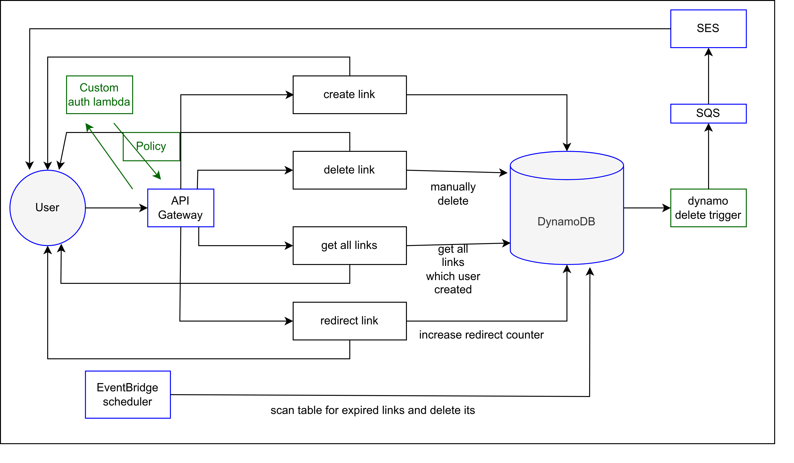
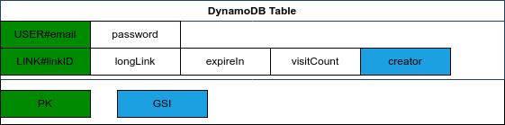

## Serverless shortlinker

### How to use

1. npm install
2. sls deploy

### Endpoints

* **POST** /auth/signin {email:string, password: string} - signin
* **POST** /auth/signup {email:string, password: string} - signup
* **GET** /{linkId} - redirect to your link
* **GET** /links {Bearer Token} - get all users links
* **DELETE** /links/{id} {BearerToken} - delete link by id
* **PUT** /links {BearerToken + {url: original url, ttl: "one-time" | "1d" | "3d" | "7d" } } - create link
